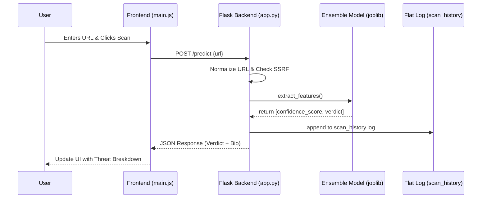
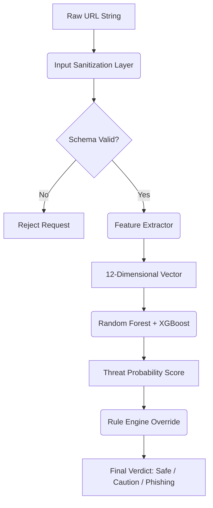
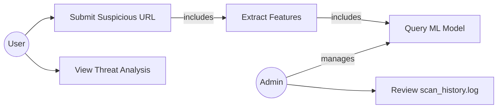

# SecOps Phishing Scanner

A Hybrid AI-Heuristic production-grade SOC tool that uses Machine Learning to detect malicious, typosquatted, and parked domains with explainable threat analysis.

## Features

- **Tri-Model Ensemble Engine:** Combines Random Forest, XGBoost, and Logistic Regression for highly accurate threat voting.
- **2019-2026 Threat Intelligence:** Trained on verified JPCERTCC datasets combined with generated safe-domain profiles.
- **Parked Domain & Redirect Detection:** Blocks hidden logic, 'For Sale' domains, and malicious Telegram/X redirects.
- **Leetspeak De-obfuscation:** Automatically detects obfuscated brand names (e.g., `faceb00k`, `whats@pp`).
- **Intent vs. Identity:** Uses Levenshtein distance & WHOIS domain age to provide nuanced "Caution" vs "Phishing" alerts.
- **Zero-Trust Hardening:** Blocks SSRF network scans and non-HTTP schemas locally.
- **Intelligent URL Auto-Fix:** Automatically maps common brand names to official domains (e.g., `google` → `https://google.com`).
- **First-Visit Onboarding:** Smart modal guides new users through the tool's three-step analysis workflow.
- **Spectrum Confidence Scoring:** Delivers naturalized confidence scores (40-99%) instead of binary extremes, providing nuanced threat assessment.

## How It Works

### The Three-Step Analysis

1. **Submission:** User enters any URL from email, messaging apps, or suspicious links.
2. **AI Analysis:** The system performs:
   - Machine Learning classification (Random Forest, XGBoost, Logistic Regression ensemble)
   - Heuristic checks (domain age, HTTPS validity, entropy, typosquatting detection)
   - Leetspeak normalization (catches obfuscated brand names)
   - Redirect analysis (detects social media weaponization)
3. **Clear Verdict:** Returns one of three verdicts with detailed threat breakdown:
   - **SAFE (Green):** Domain passes all checks with high confidence (90-99%).
   - **CAUTION (Amber):** Potential risks detected; domain needs manual verification (50-70%).
   - **PHISHING (Red):** High-confidence malicious intent detected (80-99%).

### Confidence Scoring Explained

The system returns naturalized confidence scores reflecting the model's actual conviction level, not binary extremes:

| Confidence | Meaning                     | Example                                               |
| ---------- | --------------------------- | ----------------------------------------------------- |
| 95-99%     | Extremely high confidence   | `google.com` (known brand, all checks pass)           |
| 80-94%     | High confidence             | `paypal.com` (legitimate, minor alert triggered)      |
| 70-79%     | Moderately high confidence  | Typo of known brand with live hosting                 |
| 50-69%     | Moderate uncertainty        | Newly registered domain with partial brand similarity |
| 40-49%     | Moderate skepticism         | Unknown domain with multiple warning flags            |
| 20-39%     | Low confidence (suspicious) | Phishing indicators present but not definitive        |

**Note:** Scores are dynamic and reflect the actual machine learning probability output, not arbitrary bins. The model can return any value in this spectrum.

## System Diagrams

### Request / Response Sequence

### Data Flow (Level 1)

### Use Case Overview

## Getting Started

1. `pip install -r requirements.txt`
2. `python train_model.py` (Downloads dataset, compiles synthetic data, trains the Tri-Model Joblib).
3. `python app.py` (Starts the Flask SOC UI locally on `http://0.0.0.0:5000`).
4. Open browser to `http://localhost:5000` or access from any device on the same network via `http://<your-ip>:5000`.

## Phone/Mobile Access

To access from a mobile device on the same Wi-Fi network:

1. Find your computer's IP: Run `ipconfig` (Windows) or `ifconfig` (Mac/Linux)
2. On phone browser, visit: `http://<your-computer-ip>:5000`
3. Example: `http://10.189.5.149:5000`

## Auto-Fix for Common Inputs

The system intelligently maps common shortcuts to official domains:

- `google` → `https://google.com`
- `paypal` → `https://paypal.com`
- `zenithbank` → `https://zenithbank.com`

This prevents false positives when users forget to include the domain extension.
