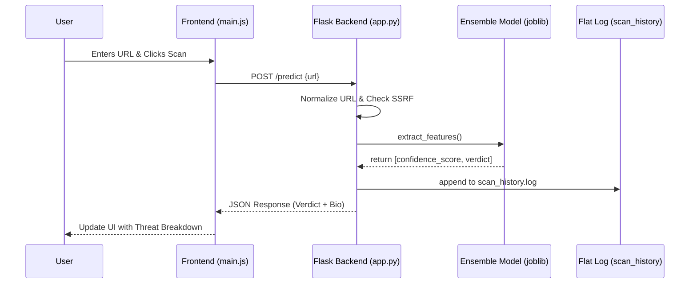
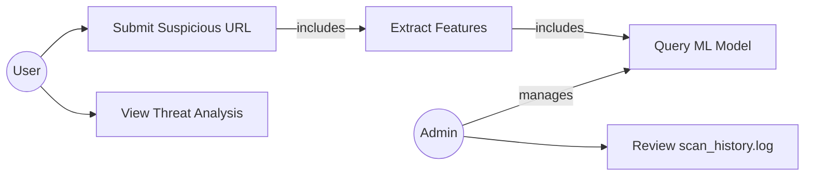
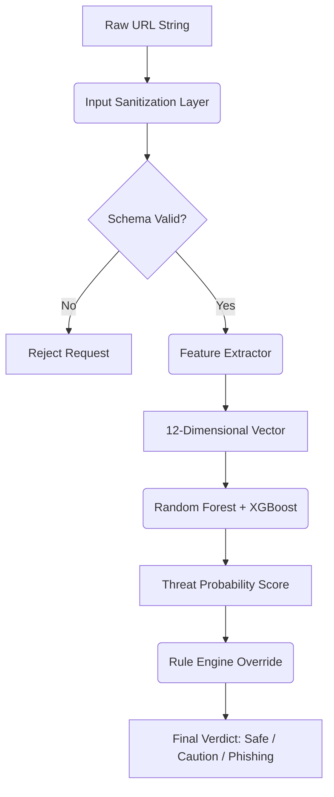

# SecOps Phishing Scanner: Technical Documentation

## 1. Purpose and Audience

This document is intended for:

- Developers extending backend and frontend scanner behavior.
- Security researchers validating detection logic and threat assumptions.
- Operators deploying the scanner in lab, internal SOC, or education contexts.

It focuses on architecture internals, data flow, model behavior, deterministic overrides, and security controls.

## 2. System Architecture

The scanner is a hybrid AI + heuristic web application:

- Backend: Flask API and rule engine.
- Feature pipeline: deterministic URL feature extraction.
- ML core: voting ensemble for probabilistic phishing classification.
- Decision layer: post-model safety overrides for high-confidence threat/safe conditions.
- Frontend: interactive single-page interface with charting and threat explanations.
- Logging: append-only scan history at logs/scan_history.log.

### 2.1 Core Components

- app.py
  - HTTP routes: /, /predict, /feedback
  - Input normalization and validation
  - SSRF and schema hardening
  - URL liveliness and parked-domain checks
  - Leetspeak normalization + brand typo detection
  - ML inference + deterministic override layer
  - JSON response assembly

- feature_extractor.py
  - Produces 12 numeric features used by the ensemble model.

- phishing_model.joblib
  - Persisted sklearn-compatible voting classifier.

- static/main.js
  - Request/response UX logic
  - First-visit onboarding modal (localStorage)
  - Threat summary rendering and iconography
  - Confidence and verdict visualization

- templates/index.html
  - UI structure and style primitives.

## 3. End-to-End Processing Flow

1. User submits URL candidate in UI.
2. Backend normalizes missing schemes and incomplete host input.
3. Security gate blocks malicious schemas and internal/private targets.
4. URL feature extraction is executed.
5. Optional network probe collects liveliness, redirect target, and parked indicators.
6. Brand-impersonation logic checks typosquatting and leetspeak variants.
7. Ensemble model computes class and probabilities.
8. Deterministic override layer adjusts outcome in high-confidence edge cases.
9. Final verdict, confidence, and explanations are returned as JSON.
10. Optional user feedback is submitted to /feedback for review queueing.
11. Scan event is logged for audit and analysis.

### 3.1 Sequence Diagram



### 3.2 Use Case Diagram



### 3.3 Data Flow Diagram (Level 1)



## 4. Input Normalization Strategy

The backend accepts raw user entries and canonicalizes input before inference.

Examples:

- google -> https://google.com
- zenithbank -> https://zenithbank.com
- mytestsite -> https://mytestsite.com (fallback)

Response fields expose normalized and resolved values:

- normalized_url: URL analyzed by the model after preprocessing.
- resolved_url: Final destination after redirects when network probe succeeds.

## 5. Feature Engineering (12-Dim Vector)

The feature extractor emits a vector with this semantic mapping:

1. Length
2. Dots
3. Hyphens
4. HTTPS
5. Suspicious Term
6. Brand Typo
7. Known Brand
8. High-Risk TLD
9. Is HTTP
10. Entropy
11. At Symbol
12. Domain Age

Interpretation highlights:

- Entropy > 3.5 can indicate algorithmically generated domains.
- Domain age < 30 days amplifies risk, especially with brand similarity.
- At symbol usage often implies obfuscation intent.

## 6. Brand and Leetspeak Detection

The engine uses:

- Levenshtein ratio and distance over known brand dictionary.
- Leetspeak de-obfuscation on host strings (for example 0->o, @->a, 1->l, 3->e, 4->a).

Threat classes produced by this layer:

- Strong spoof with high confidence phishing signal.
- Edge-case similarity routed to caution if other indicators are weak.

## 7. Ensemble Inference and Decision Policy

### 7.1 Model Output

The voting ensemble returns:

- prediction_num: class index
- probabilities: array [P_safe, P_phishing]

### 7.2 Deterministic Overrides

Post-model logic enforces rule-based safety for explicit cases:

- Force safe for trusted whitelist contexts.
- Force phishing for strong spoof, parked-domain evidence, or high-risk redirects.
- Elevate to caution for ambiguity and mixed signals.

### 7.3 Confidence Value

Confidence is based on the top class probability with display cap to avoid overclaiming certainty.

Operational interpretation:

- 90-99.99: very strong signal.
- 60-89: moderate to strong signal.
- 40-60: uncertainty band, typically caution-worthy.

## 8. Security Controls

Implemented controls include:

- Schema sanitization: reject javascript: and data:.
- SSRF protections: block internal/private address ranges.
- Request timeout boundaries for network probes.
- Minimal information leakage in API errors.

Residual risk notes:

- Public DNS poisoning and transient infra anomalies can affect liveliness checks.
- WHOIS freshness and registrar data may vary by provider and TLD.

## 9. API Contract

Endpoint: POST /predict

Request body:

```json
{
  "url": "example input"
}
```

Success response:

```json
{
  "prediction": "Safe",
  "confidence": 88.42,
  "normalized_url": "https://google.com",
  "resolved_url": "https://www.google.com/",
  "is_known_domain": true,
  "model_uncertain": false,
  "bio": "It looks like you are trying to visit Google...",
  "safe_link": "https://google.com",
  "is_live": true,
  "ping_warning": "",
  "suggested_site": null,
  "threat_summary": ["[PASS] No active heuristic threats detected."]
}
```

Endpoint: POST /feedback

Request body:

```json
{
  "url": "https://unknown-example.com",
  "user_label": "phishing",
  "note": "Tried to mimic login form",
  "model_prediction": "Caution",
  "model_confidence": 55.3,
  "is_known_domain": false,
  "model_uncertain": true
}
```

Success response:

```json
{
  "ok": true,
  "message": "Feedback saved for review pipeline."
}
```

Error response pattern:

```json
{
  "error": "Error message"
}
```

## 10. Frontend Behavior Notes

- Onboarding is versioned using localStorage key secops_onboarding_seen_version.
- Shared-device compromise banner is cooldown-controlled by secops_tour_banner_dismiss_until.
- Manual triggers (About This Tool and Start Quick Tour) reopen onboarding without forcing refresh spam.
- Threat summary items render icon by prefix tags: [PASS], [WARN], [FAIL].
- UI writes normalized_url back into input for transparency.
- Feedback panel appears for uncertain outcomes or unknown domains and posts labels to /feedback.

## 11. Logging and Observability

Scan events are written to logs/scan_history.log with timestamp and verdict metadata.

Example:

2026-03-27 14:23:45 | URL: https://g00gle.com | Prob: 95% | Status: Phishing

Recommended production additions:

- Structured JSON logging for SIEM ingestion.
- Correlation IDs per request.
- Metrics for false-positive/false-negative trend analysis.

## 12. Developer Workflow

Typical local workflow:

1. Install dependencies.
2. Train or load model.
3. Run flask app.
4. Execute synthetic tests.
5. Review log output and UI behavior.

Suggested validation scenarios:

- clean known domains
- missing-TLD input
- typo/leetspeak brand spoof
- parked domains and dead links
- high-risk TLD cases
- internal address SSRF attempts

## 13. Research Notes and Extension Points

Potential improvements:

- Confidence calibration (Platt/Isotonic) for better probability reliability.
- Feature drift monitoring and periodic retraining.
- Additional lexical features (n-grams, homoglyph detection, unicode confusables).
- Passive DNS and certificate transparency enrichment.
- Multi-language phishing lexicon expansion.

## 14. Ethics and Safe Use

This project is designed for defensive education and protective URL triage.
Do not use this system to automate offensive phishing operations.
